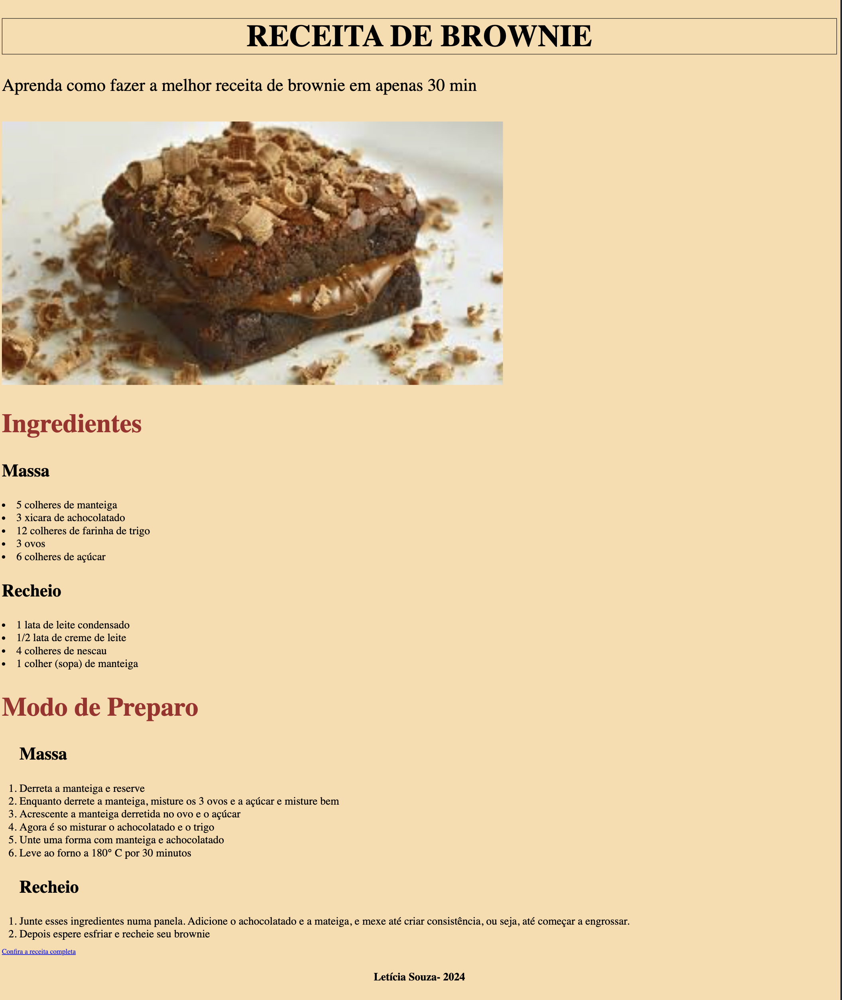

# Receita--2024

---
## Sobre
Site para divulgar uma receita de brownie. O intuito desde projeto é colocar em prática o conhecimento adquirido sobre as linguagens de marcação, HTML, CSS e Markdown, no curso Técnico de Desenvolvimento de Sistemas do [SENAI JANDIRA](https://sp.senai.br/unidade/jandira/)

---
## Tecnologias utilizadas
- HTML
- CSS
- Markdown
- Git

---
## Autor 
- [Letícia Souza](https://www.linkedin.com/in/leticia-souza-almeida-84712a2b5/)